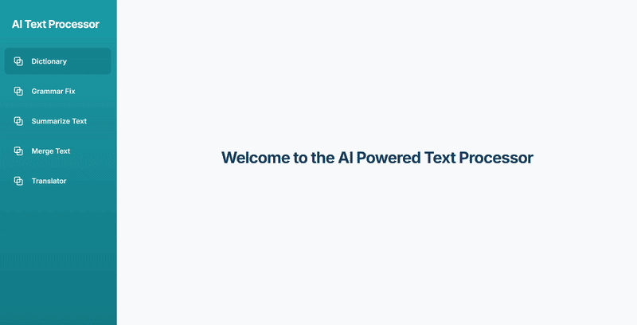
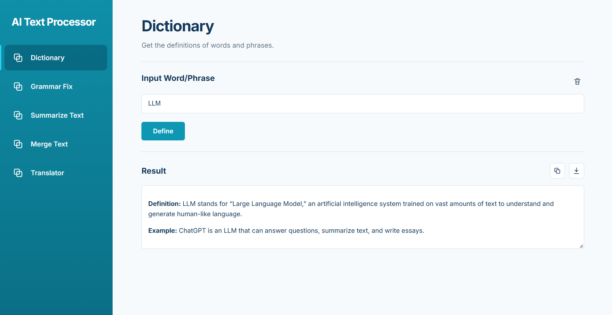
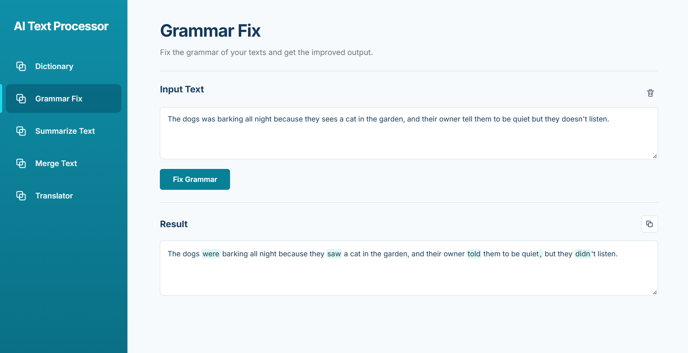
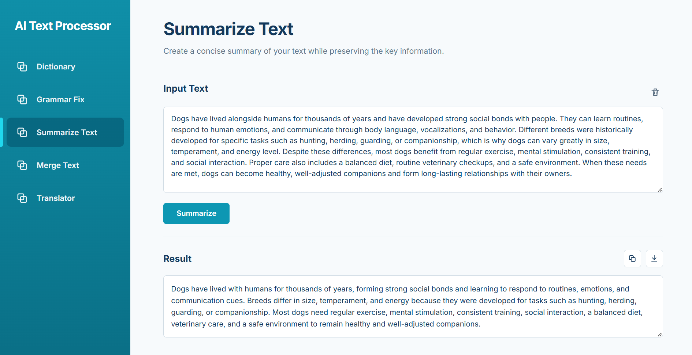
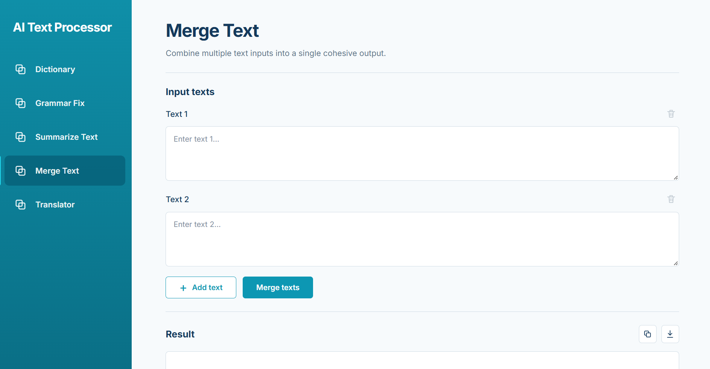
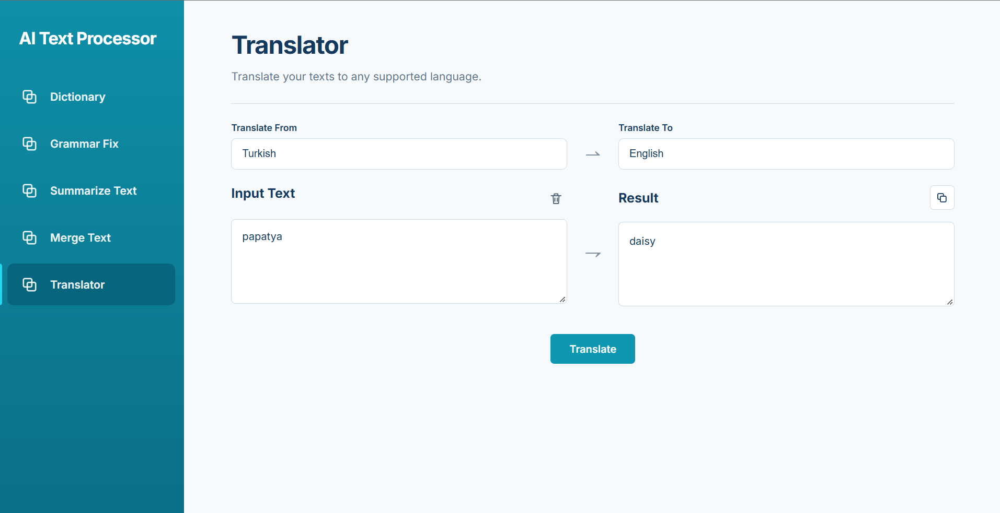

# AI Text Processor
A lightweight AI-powered text processing web application built with Python, FastAPI, HTML, CSS, and JavaScript.
The application provides a collection of focused text-processing tools powered by a large language model.

## Demo




## Features
### Dictionary
Look up a word or phrase and receive:

- A concise definition
- An example sentence

### Grammar Fix
Correct grammar and spelling while preserving the original meaning.
The interface highlights changes and allows individual corrections to be undone.

### Summarizer
Generate a concise summary while preserving the important information from the original text.

### Merge Text
Combine multiple pieces of text into one coherent result. 
It supports minimum of 2 maximum of 5 texts to be merged at the same time.

The merge process:

- Removes redundant information
- Preserves unique information
- Avoids introducing new facts

### Translator
Translate text between supported languages language selectors.

## Tech Stack
### Backend
- Python 3.14+
- FastAPI
- Pydantic
- Pydantic Settings
- OpenAI API
- Uvicorn

### Frontend
- HTML
- CSS
- JavaScript

### Development
- uv for dependency management
- pytest for testing
- Git / GitHub

## Setup
### Prerequisites
- Python 3.14+
- [uv](https://docs.astral.sh/uv/)
- An API key for the configured LLM provider

### 1. Clone the repository
```bash
git clone https://github.com/zoyayci/AI-Text-Processor.git
cd AI-Text-Processor
```

### 2. Install dependencies
```bash
uv sync
```

### 3. Configure environment variables
Create a `.env` file from `.env.example`.

Linux/macOS:
```bash
cp .env.example .env
```

Windows PowerShell:
```powershell
Copy-Item .env.example .env
```

Then configure the environment variables:
```env
LLM_API_KEY=your_api_key_here
LLM_MODEL=your_model_name
```

`LLM_API_BASE` is optional.
The `.env` file is ignored by Git and should not be committed.

### 4. Run the application

```bash
uv run uvicorn app.main:app --reload
```

Open the application at:

```text
http://127.0.0.1:8000
```

FastAPI documentation is available at:

```text
http://127.0.0.1:8000/docs
```

### 5. Run the tests
```bash
uv run pytest
```

## Screenshots

### Dictionary



### Grammar Fix




### Summarizer



### Merge Text



### Translator




## Project Structure
```text
AI-Text-Processor/
│
├── app/
│   ├── api/
│   │   ├── dependencies.py
│   │   ├── dictionary.py
│   │   ├── grammar_fix.py
│   │   ├── summarizer.py
│   │   ├── text_merge.py
│   │   └── translator.py
│   │
│   ├── core/
│   │   └── config.py
│   │
│   ├── schemas/
│   │   ├── dictionary.py
│   │   ├── grammar_fix.py
│   │   ├── summarizer.py
│   │   ├── text_merge.py
│   │   └── translator.py
│   │
│   ├── services/
│   │   ├── dictionary_service.py
│   │   ├── grammar_fix_service.py
│   │   ├── llm_service.py
│   │   ├── summarizer_service.py
│   │   ├── text_merge_service.py
│   │   └── translator_service.py
│   │
│   ├── static/
│   │   ├── css/
│   │   │   └── styles.css
│   │   │
│   │   ├── html/
│   │   │   ├── dictionary.html
│   │   │   ├── grammar-fix.html
│   │   │   ├── summarizer.html
│   │   │   ├── text-merge.html
│   │   │   ├── translator.html
│   │   │   └── welcome.html
│   │   │
│   │   └── js/
│   │       ├── dictionary.js
│   │       ├── grammar-fix.js
│   │       ├── language_list.js
│   │       ├── main.js
│   │       ├── summarizer.js
│   │       ├── text-merge.js
│   │       └── translator.js
│   │
│   ├── templates/
│   │   └── index.html
│   │
│   └── main.py
│
├── docs/
│   ├── gifs/
│   │   └── AI-Text-Processor-Demo.gif
│   │
│   └── images/
│       ├── 1-WelcomePage.png
│       ├── 2-Dictionary.png
│       ├── 3-GrammarFix.png
│       ├── 3b-GrammarFix-PopUp.png
│       ├── 4-Summarizer.png
│       ├── 5-MergeText.png
│       └── 6-Translator.png
│
├── tests/
│   ├── test_dictionary_api.py
│   ├── test_dictionary_service.py
│   ├── test_grammar_fix_api.py
│   ├── test_grammar_fix_service.py
│   ├── test_summarizer_api.py
│   ├── test_summarizer_service.py
│   ├── test_text_merge_api.py
│   ├── test_text_merge_service.py
│   ├── test_translator_api.py
│   └── test_translator_service.py
│
├── .env.example
├── .gitignore
├── pyproject.toml
├── uv.lock
└── README.md
```